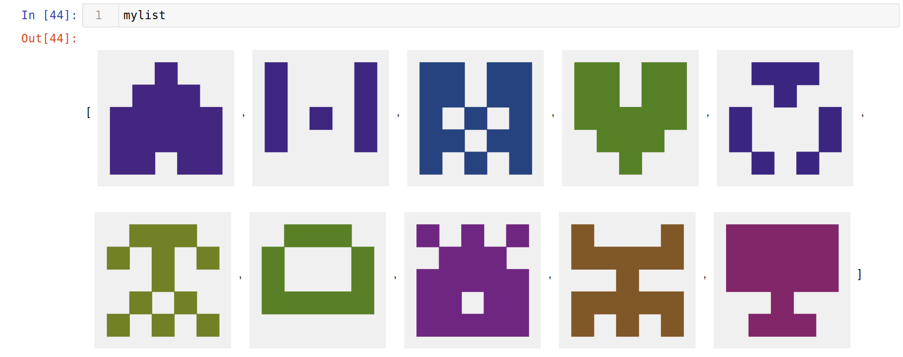
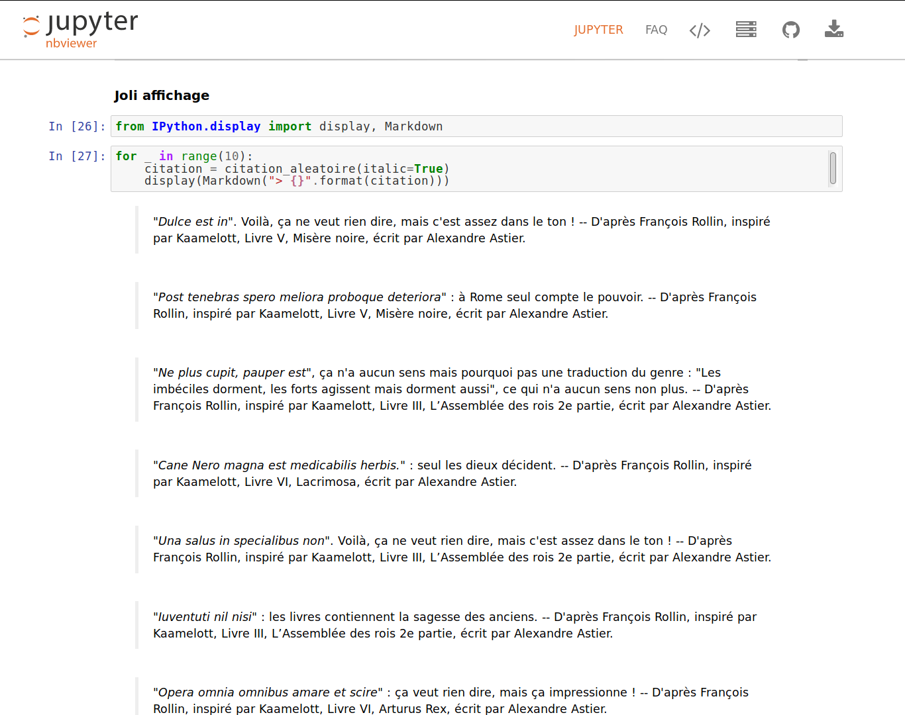

# [Jupyter Notebooks](http://jupyter.org/) :notebook: by [Naereen @ GitHub](https://naereen.github.io/)

This repository hosts some [Jupyter Notebooks](http://jupyter.org/), covering various subjects.
Go to [nbviewer](https://nbviewer.jupyter.org/github/Naereen/notebooks/blob/master/) to read them.

You can also launch an interactive environment to play with the code by yourself, using one of these platforms: [](https://mybinder.org/v2/gh/Naereen/notebooks/master) [](https://colab.research.google.com/github/Naereen/notebooks/blob/master/)

> At the beginning, this repository was only here to host some small experiments, for me to learn how to use [the wonderful Jupyter tools](http://jupyter.org/) correctly (baby notebooks :baby_bottle:)...

## :shell: Bash
- The first notebooks I wrote are small tutorials for :shell: `bash` commands (or some of my [command-line scripts](https://bitbucket.org/lbesson/bin/src/master/)), see for example [a tutorial on head and a tail](https://nbviewer.jupyter.org/github/Naereen/notebooks/blob/master/Tutorial%20on%20head%20and%20tail%20%28bash%29.ipynb) ([on GitHub?](Tutorial%20on%20head%20and%20tail%20%28bash%29.ipynb)).

## :snake: Python
> I am a passionate user of [the Python programming language](https://www.python.org/).

### Science
- [This notebook written for the Pi Day 2017](https://nbviewer.jupyter.org/github/Naereen/notebooks/blob/master/Py_Pi_Day_2017.ipynb) ([on GitHub?](Py_Pi_Day_2017.ipynb)) demonstrates a dozen of easy algorithms to compute from 10 to 100000 digits of the *number pi*.

- [This notebook implements a simple example of the *simulated annealing* algorithm](https://nbviewer.jupyter.org/github/Naereen/notebooks/blob/master/Simulated_annealing_in_Python.ipynb) ([on GitHub?](Simulated_annealing_in_Python.ipynb)) to minimize black-box functions :sunglasses:.

- [This notebook shows a hand-written and clear implementation](https://nbviewer.jupyter.org/github/Naereen/notebooks/blob/master/Manual_implementation_of_some_hash_functions.ipynb) ([on GitHub?](Manual_implementation_of_some_hash_functions.ipynb)) of several [Hashing functions](https://docs.python.org/3/library/hashlib.html), like `MD5`, `SHA1`, and all variants of `SHA2` (`SHA256`, `SHA224`, `SHA512`, `SHA384`).

- [This notebook shows a manual implementation](https://nbviewer.jupyter.org/github/Naereen/notebooks/blob/master/Short_study_of_the_Lempel-Ziv_complexity.ipynb) ([on GitHub?](Short_study_of_the_Lempel-Ziv_complexity.ipynb)) of the [Lempel-Ziv complexity](https://en.wikipedia.org/wiki/Lempel-Ziv_complexity) in pure Python, and then as optimized Python code, with Cython or Numba. I also wrote a version in [Julia](http://julialang.org) (in the same notebook), and compare the 4 implementations! I then published my code as a Pypy package, see [here on pypi.org](https://pypi.org/project/Lempel-Ziv_Complexity/).

- [This notebook shows a hand-written and clear implementation](https://nbviewer.jupyter.org/github/Naereen/notebooks/blob/master/Manual_implementation_of_the_Mersenne_twister_PseudoRandom_Number_Generator__PRNG_.ipynb) ([on GitHub?](Manual_implementation_of_the_Mersenne_twister_PseudoRandom_Number_Generator__PRNG_.ipynb)) of several [Pseudo-Random Number Generators](https://docs.python.org/3/library/random.html), including the famous *Mersenne twister* algorithm, and then uses it to samples from the most famous discrete and continuous distributions, showcasing use of the Inverse-Transform method and Acceptance-Rejection method (cf. Markov Chain Monte-Carlo methods).

- [This notebook implements and compares different Runge-Kutta methods](https://nbviewer.jupyter.org/github/Naereen/notebooks/blob/master/Runge-Kutta_methods_for_ODE_integration_in_Python.ipynb) ([on GitHub?](Runge-Kutta_methods_for_ODE_integration_in_Python.ipynb)) for integrating Ordinary Differential Equations in Python. And also [in Julia](https://nbviewer.jupyter.org/github/Naereen/notebooks/blob/master/Runge-Kutta_methods_for_ODE_integration_in_Julia.ipynb) ([on GitHub?](Runge-Kutta_methods_for_ODE_integration_in_Julia.ipynb)), and also [in OCaml](https://nbviewer.jupyter.org/github/Naereen/notebooks/blob/master/Runge-Kutta_methods_for_ODE_integration_in_OCaml.ipynb) ([on GitHub?](Runge-Kutta_methods_for_ODE_integration_in_OCaml.ipynb)). I wanted to compare the three languages for the same algorithms. Well, obviously, Julia is the fastest and simplest for numerical simulations like this.

- :fr: [Ce petit notebook en français](https://nbviewer.jupyter.org/github/Naereen/notebooks/blob/master/Verification_de_numeros_CB_RIB_NIRPP_IBAN.ipynb) ([sur GitHub ?](Verification_de_numeros_CB_RIB_NIRPP_IBAN.ipynb)) implémente les algorithmes de vérifications des numéros de cartes bleues, de sécurité sociale et d'IBAN en Python.

- [This notebook implements and explore the Exponential Integral function Ei(x)](https://nbviewer.jupyter.org/github/Naereen/notebooks/blob/master/Exponential_Integral_Python.ipynb) ([on GitHub?](Exponential_Integral_Python.ipynb)).

- [This notebook shows how to solve the equation `exp(- a x²)=x` both numerically and formally (with the Lambert W function)](https://nbviewer.jupyter.org/github/Naereen/notebooks/blob/master/Solving_an_equation_and_the_Lambert_W_function.ipynb) ([on GitHub?](Solving_an_equation_and_the_Lambert_W_function.ipynb)).

- [This notebook implements Kullback-Leibler divergences for some parametric distributions, and KL-UCB indexes, in naive Python and compare with optimized versions using JIT compilation by Numba or C compilation by Cython](https://nbviewer.jupyter.org/github/Naereen/notebooks/blob/master/Kullback-Leibler_divergences_in_native_Python__Cython_and_Numba.ipynb) ([on GitHub?](Kullback-Leibler_divergences_in_native_Python__Cython_and_Numba.ipynb)).

- [This short notebook defines and studies the Rényi entropy](https://nbviewer.jupyter.org/github/Naereen/notebooks/blob/master/A_short_study_of_Renyi_entropy.ipynb) ([on GitHub?](A_short_study_of_Renyi_entropy.ipynb)).

- :fr: [Ce notebook présente des approches simples pour générer un dictionnaire des mots français adaptés à l'écriture inclusive](https://nbviewer.jupyter.org/github/Naereen/notebooks/blob/master/Ecriture%20inclusive.ipynb), comme beau/belle -> beau·elle, professeur/professeure -> professeur·e, il/elle -> iel/ielle etc ([on GitHub?](Ecriture%20inclusive.ipynb)). [Ici ce trouve le dictionnaire généré (contenant environ 26 000 mots différents)](french_inclusive.txt). Work in progress... (je ne terminerai pas, c'est trop compliqué de faire ça parfaitement)

### Teaching
- :fr: [Ce notebook en français présente les problèmes de bandits multi-bras stochastiques](https://nbviewer.jupyter.org/github/Naereen/notebooks/blob/master/Introduction_aux_algorithmes_de_bandit__comme_UCB1_et_Thompson_Sampling.ipynb) ([on GitHub?](Introduction_aux_algorithmes_de_bandit__comme_UCB1_et_Thompson_Sampling.ipynb)) (*multi-armed bandit*, MAB), et les algorithmes dits "de bandits" pour les résoudre (UCB "Upper Confidence Bounds", KL-UCB, Thompson Sampling, Approximated Finite-Horizon Gittins index etc). C'est une bonne introduction aux outils que j'utilise pour [ma thèse](http://perso.crans.org/besson/phd/).

- :fr: I corrected some maths & programming problems from the annals of the [CentraleSupelec national competitive](http://www.concours-centrale-supelec.fr/) exam (in France), in this notebook [Oraux_CentraleSupelec_PSI__Juin_2017.ipynb](https://nbviewer.jupyter.org/github/Naereen/notebooks/blob/master/Oraux_CentraleSupelec_PSI__Juin_2017.ipynb) ([on GitHub?](Oraux_CentraleSupelec_PSI__Juin_2017.ipynb)) (for [this kind of oral exam](http://www.concours-centrale-supelec.fr/CentraleSupelec/MultiY/C2015/)). Again in 2018, [Oraux_CentraleSupelec_PSI__Juin_2018.ipynb](https://nbviewer.jupyter.org/github/Naereen/notebooks/blob/master/Oraux_CentraleSupelec_PSI__Juin_2018.ipynb) ([on GitHub?](Oraux_CentraleSupelec_PSI__Juin_2018.ipynb)).

- :fr: [Ce notebook en français est un petit tutoriel pour apprendre à résoudre des problèmes/programmes linéaires en Python avec SciPy](https://nbviewer.jupyter.org/github/Naereen/notebooks/blob/master/Mini_tutoriel_pour_la_resolution_de_programmes_lineaires_avec_Python__ENS_Rennes_2021.ipynb), pour le cours [ALGO2](http://people.irisa.fr/Francois.Schwarzentruber/algo2/) à [l'ENS Rennes](http://www.dit.ens-rennes.fr/) en janvier 2021 ([on GitHub?](Mini_tutoriel_pour_la_resolution_de_programmes_lineaires_avec_Python__ENS_Rennes_2021.ipynb)).

- :fr: [Ce notebook en français montre une expérimentation de visualisation interactive de l'algorithme du Simplexe](https://nbviewer.jupyter.org/github/Naereen/notebooks/blob/master/Une_exploration_visuelle_de_l_algorithme_du_Simplexe_en_3D_avec_Python.ipynb), pour le cours [ALGO2](http://people.irisa.fr/Francois.Schwarzentruber/algo2/) à [l'ENS Rennes](http://www.dit.ens-rennes.fr/) en février 2021 ([on GitHub?](Une_exploration_visuelle_de_l_algorithme_du_Simplexe_en_3D_avec_Python.ipynb)).

- :fr: [Ce petit notebook en français présente un challenge](https://nbviewer.jupyter.org/github/Naereen/notebooks/blob/master/F%C3%A9vrier%202021%20un%20mini%20challenge%20arithm%C3%A9tico-algorithmique.ipynb) : « Comptez le nombre de mois de février répondant à ce critère (je n'ai pas trouvé de nom précis), depuis l'année de création de l'ENS Rennes (1994, enfin pour Cachan antenne Bretagne) jusqu'à 2077 (1994 et 2077 inclus). ». ([on GitHub?](F%C3%A9vrier%202021%20un%20mini%20challenge%20arithm%C3%A9tico-algorithmique.ipynb)).

### Numerical simulations for dice games (:fr: in French)
- I also wrote some notebooks on numerical simulations of dice games :fr: Voir [ce sous-dossier](https://nbviewer.jupyter.org/github/Naereen/notebooks/blob/master/simus/) (ou [sur GitHub?](simus/)) / :gb: See [this sub-folder](https://nbviewer.jupyter.org/github/Naereen/notebooks/blob/master/simus/) (or [on GitHub?](simus/)).

### :art: Art
- [This notebook shows some "obfuscated" code, producing](https://nbviewer.jupyter.org/github/Naereen/notebooks/blob/master/Obfuscated_code_or_piece_of_art.ipynb) ([on GitHub?](Obfuscated_code_or_piece_of_art.ipynb)) :sparkles: [nice figures](art/)... Or maybe they are pieces of code art :art: ?
- [This notebook implements in Python a generator of small "identicon" like the dislayed on GitHub for users without profile pictures](https://nbviewer.jupyter.org/github/Naereen/notebooks/blob/master/An_Identiconizer_generator_implementation_in_Python.ipynb) ([on GitHub?](An_Identiconizer_generator_implementation_in_Python.ipynb)) :sparkles:. See this example:



- :fr: [Ce notebook montre comment générer des fausses citations latines du Roi Loth](https://nbviewer.jupyter.org/github/Naereen/notebooks/blob/master/Generer_des_fausses_citations_latines_du_Roi_Loth.ipynb), avec une chaîne de Markov, la liste de locutions latines extraite de Wikipédia, et la liste des vraies citations latines du Roi Loth extraite de Wikiquote. Exemples :



> I will try to write more *artistic* notebooks, showcasing nice pieces of *code* :art:!

### Experiments with Python
- [This small notebook](https://nbviewer.jupyter.org/github/Naereen/notebooks/blob/master/Living_in_a_noisy_world_with_James_Powell_rwatch_module.ipynb) ([on GitHub?](Living_in_a_noisy_world_with_James_Powell_rwatch_module.ipynb)) is a fun experiment, where I tried to use [James Powell (@dutc)](https://GitHub.com/dutc) [rwatch](https://GitHub.com/dutc/rwatch) module to write a Python context manager to add a Gaussian white noise to every numbers inside the context... Something like: `with noise(): x = 10` will produce `x = 10.325` for instance... It fails, but I almost got it, and it works (without breaking the interpreter) for complex numbers. That's already intersting!

- [This notebook](https://nbviewer.jupyter.org/github/Naereen/notebooks/blob/master/Floating_point_error_propagation_in_polynomial_multiplication_with_Fast-Fourier_Transform.ipynb) ([on GitHub?](Floating_point_error_propagation_in_polynomial_multiplication_with_Fast-Fourier_Transform.ipynb)) is a small experiment, written quickly, about floating-point error propagation when using a non-naive polynomial multiplication with evaluation-and-interpolation. Sadly, this approach fails!

- [A tiny presentation on how to do time/memory profiling](https://nbviewer.jupyter.org/github/Naereen/notebooks/blob/master/Profiling_in_a_Jupyter_notebook.ipynb) ([on GitHub?](Profiling_in_a_Jupyter_notebook.ipynb)) from *inside* the Jupyter notebook interface, with various approaches.

## Experiments with Jupyter
- [This notebook shows how to register a custom HTML writer for builtins or user-defined types in IPython and Jupyter](https://nbviewer.jupyter.org/github/Naereen/notebooks/blob/master/Demonstration%20of%20numpy.polynomial.Polynomial%20and%20nice%20display%20with%20LaTeX%20and%20MathJax%20%28python3%29.ipynb) ([on GitHub?](Demonstration%20of%20numpy.polynomial.Polynomial%20and%20nice%20display%20with%20LaTeX%20and%20MathJax%20%28python3%29.ipynb)), for the sake of the example I wrote a nice LaTeX/MathJax-powered print function that nicely displays polynomials from the `numpy.polynomial.Polynomial` module or class.

- [A small benchmark between Python, Pypy and Julia for the Romberg numerical integration algorithm](https://nbviewer.jupyter.org/github/Naereen/notebooks/blob/master/Benchmark_between_Python_and_Julia.ipynb) ([on GitHub?](Benchmark_between_Python_and_Julia.ipynb)). Julia is the fastest, but Pypy is very fast too :snake: !

- Demo of the [RISE Jupyter extension](https://github.com/damianavila/RISE) to easily write a dynamic slideshow in a Jupyter notebook, [for Python](https://nbviewer.jupyter.org/github/Naereen/notebooks/blob/master/Demo_of_RISE_for_slides_with_Jupyter_notebooks__Python.ipynb) ([on GitHub?](Demo_of_RISE_for_slides_with_Jupyter_notebooks__Python.ipynb)) and
[for OCaml](https://nbviewer.jupyter.org/github/Naereen/notebooks/blob/master/Demo_of_RISE_for_slides_with_Jupyter_notebooks__OCaml.ipynb) ([on GitHub?](Demo_of_RISE_for_slides_with_Jupyter_notebooks__OCaml.ipynb)) :loudspeaker:.

## With [Julia](https://www.julialang.org/)
- [This notebook shows a implementation of a naive algorithm to compute eigen values and eigen vectors for full rank matrices](https://nbviewer.jupyter.org/github/Naereen/notebooks/blob/master/Algorithms_to_compute_eigen_values_and_eigen_vectors_in_Julia.ipynb) ([on GitHub?](Algorithms_to_compute_eigen_values_and_eigen_vectors_in_Julia.ipynb), on Julia.

## 🐫 [OCaml](https://www.ocaml.org/)
- Some notebooks are written in French :fr:, mainly [documents written for the preparation](agreg/) to the highly competitive French national exam to become a professor (aka the ["agrégation"](http://agreg.org/)), as since 2016 I am [a teaching assistant](https://www.irisa.fr/fr/emplois/enseignants/missions-denseignement-au-departement-informatique-lens-rennes) at [ENS de Rennes](http://www.ens-rennes.fr/) in the [Computer Science department](http://www.dit.ens-rennes.fr/), for the ["Fundamental Computer Science" minor option (D) for the agrégation exam](http://www.dit.ens-rennes.fr/agregation-option-d/). :fr: Voir [ce sous-dossier](https://nbviewer.jupyter.org/github/Naereen/notebooks/tree/master/agreg/) ([ou sur GitHub](agreg/)) / :gb: See [this sub-folder](https://nbviewer.jupyter.org/github/Naereen/notebooks/tree/master/agreg/) ([or on GitHub](agreg/)).

> And more will come... soon! :bullettrain_front:

[](http://jupyter.org/) [](https://www.python.org/) [](https://ocaml.org/) [](https://julialang.org/)

----

## 1. *How to read these documents*?

### 1.a. View the notebooks statically :memo:
- Either directly in GitHub: [see the list of notebooks](https://github.com/Naereen/notebooks/search?l=jupyter-notebook);
- Or on [nbviewer.jupiter.org](https://nbviewer.jupiter.org/): [list of notebooks](https://nbviewer.jupyter.org/github/Naereen/notebooks/tree/master/).

### 1.b. Play with the notebooks dynamically :boom:
[](http://mybinder.org/repo/Naereen/notebooks)

Anyone can use the [mybinder.org](http://mybinder.org/) website (by [clicking](http://mybinder.org/repo/Naereen/notebooks) on the icon above) to run the notebook in her/his web-browser.
You can then play with it as long as you like, for instance by modifying the values or experimenting with the code.

[](https://beta.mybinder.org/v2/gh/Naereen/notebooks/master)

> *Note:* Only the Python kernel is supported on the MyBinder interface!

----

## 2. *Requirements to run the notebooks locally*?
All [the requirements](requirements.txt) can be installed with [``pip``](https://pip.readthedocs.io/) and by running a few ``python -m ...`` commands.

> Note: if you use [Python 3](https://docs.python.org/3/) instead of [Python 2](https://docs.python.org/2/), you *might* have to *replace* ``pip`` and ``python`` by ``pip3`` and ``python3`` in the next commands (if both pip and pip3 are installed).

### 2.a. [Jupyter Notebook](http://jupyter.readthedocs.org/en/latest/install.html) and [IPython](http://ipython.org/)

```bash
sudo pip install jupyter ipython
```

It will also install all the dependencies, afterward you should have a ``jupyter-notebook`` command (or a ``jupyter`` command, to be ran as ``jupyter notebook``) available in your ``PATH``:

```bash
$ whereis jupyter-notebook
jupyter-notebook: /usr/local/bin/jupyter-notebook
$ jupyter-notebook --version  # version >= 4 is recommended
4.2.1
```

### 2.b. Other kernels (*optional*):
> They are only needed to run the notebooks written for Bash or Octave (or OCaml):

#### 2.b.1. [GNU Bash kernel](https://github.com/takluyver/bash_kernel)
- You have to have [``bash``](https://en.wikipedia.org/wiki/Bash_(Unix_shell)) installed ([already there](https://tiswww.case.edu/php/chet/bash/bashtop.html) on all Linux distribution, installable with [``brew``](http://brew.sh/) or [``macports``](https://www.macports.org/) on Mac OS, available on Windows through [``cygwin``](http://cygwin.org/)):

```bash
$ bash --version | head -n1
GNU bash, version 4.3.42(1)-release (x86_64-pc-linux-gnu)
```

- And then install the kernel ``bash_kernel`` with these *two* commands:

```bash
sudo pip install bash_kernel
python -m bash_kernel.install
```

#### 2.b.2. [GNU Octave kernel](https://github.com/calysto/octave_kernel)
- You have to have [``octave``](https://www.gnu.org/software/octave/) installed (installable with the package manager on major Linux distributions (``apt-get``, ``pacman``, ``yum`` etc), installable with [``brew``](http://brew.sh/) or [``macports``](https://www.macports.org/) on Mac OS, available on Windows through [``cygwin``](http://cygwin.org/) or [natively](https://ftp.gnu.org/gnu/octave/windows/)):

```bash
$ octave --version | head -n1
GNU Octave, version 4.0.0
```

- Your version of Octave should be installed with [gnuplot]() support (it is usually the case):

```bash
$ gnuplot --version | head -n1
gnuplot 5.0 patchlevel 1
```

- And then install the kernel ``bash_kernel`` with these *two* commands:

```bash
sudo pip install octave_kernel
python -m octave_kernel.install
```

#### 2.b.3. [OCaml kernel: `OCaml-Jupyter`](https://github.com/akabe/ocaml-jupyter)
It is quite easy to install, with [opam](https://opam.ocaml.org/):
```bash
opam install jupyter
```

> I started by using this [OCaml kernel called IOCaml](https://github.com/andrewray/iocaml/wiki/jupyter).
> The instructions were not so simple, cf. the tutorial by @andrewray on [iocaml's wiki](https://github.com/andrewray/iocaml/wiki/).
> It was prone to some bugs, and [I had to manually implement a script](https://github.com/Naereen/fix-iocaml-notebook-exports-to-pdf) to be able to convert the notebooks to PDF with `jupyter-nbconvert --to pdf`.
> Note that [I also had to write a custom Exporter](https://github.com/Naereen/Jupyter-NBConvert-OCaml/) for jupyter-nbconvert in order to convert the notebooks to OCaml scripts (`.ml`).

----

### :information_desk_person: More information?
> - More information about [notebooks (on the documentation of IPython)](https://nbviewer.jupiter.org/github/ipython/ipython/blob/3.x/examples/Notebook/Index.ipynb) or [on the FAQ on Jupyter's website](https://nbviewer.jupyter.org/faq).
> - More information about [mybinder.org](http://mybinder.org/): on [this example repository](https://github.com/binder-project/example-requirements).


## :scroll: License ? [](https://github.com/Naereen/notebooks/blob/master/LICENSE)
All the notebooks in this repository are published under the terms of the [MIT License](https://lbesson.mit-license.org/) (file [LICENSE.txt](LICENSE.txt)).
© [Lilian Besson](https://GitHub.com/Naereen), 2016-18.

[](https://GitHub.com/Naereen/notebooks/graphs/commit-activity)
[](https://GitHub.com/Naereen/ama)
[](https://GitHub.com/Naereen/notebooks/)

[](http://ForTheBadge.com)
[](https://GitHub.com/)

[](https://GitHub.com/Naereen/)
