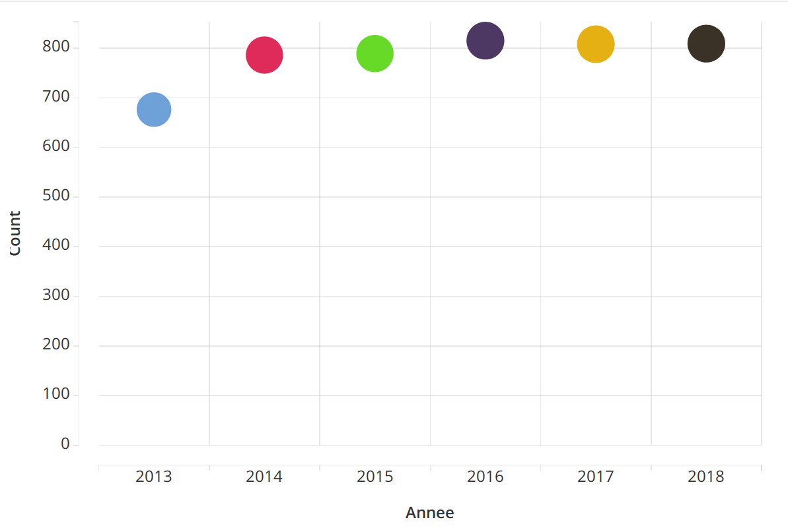
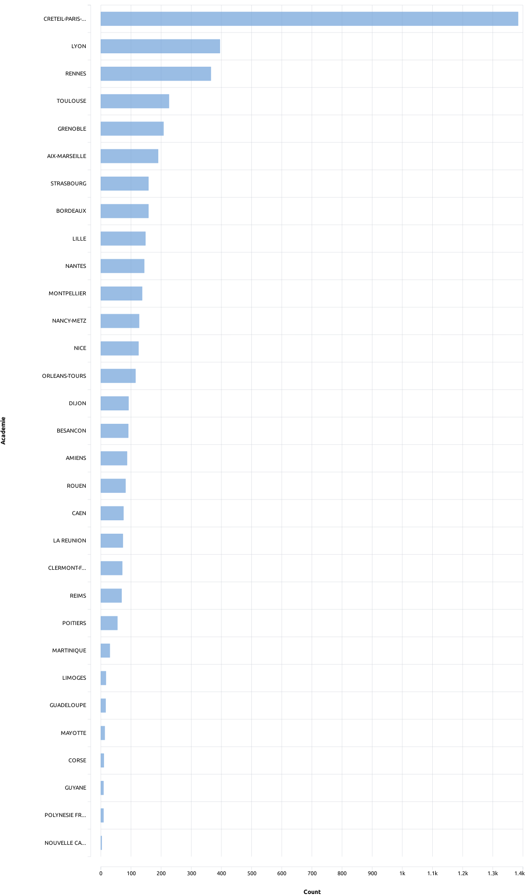
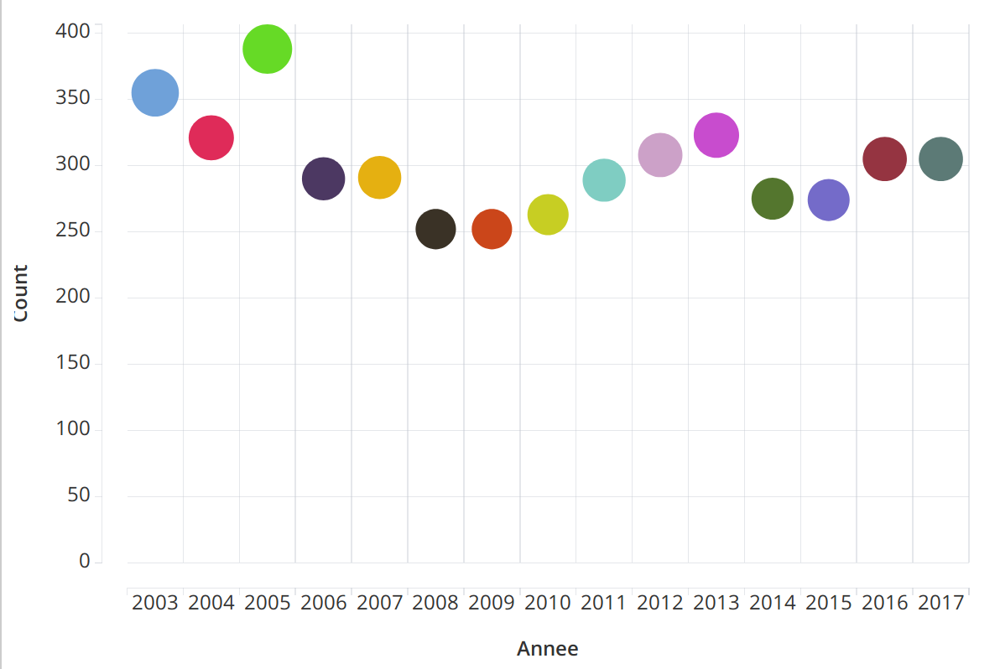
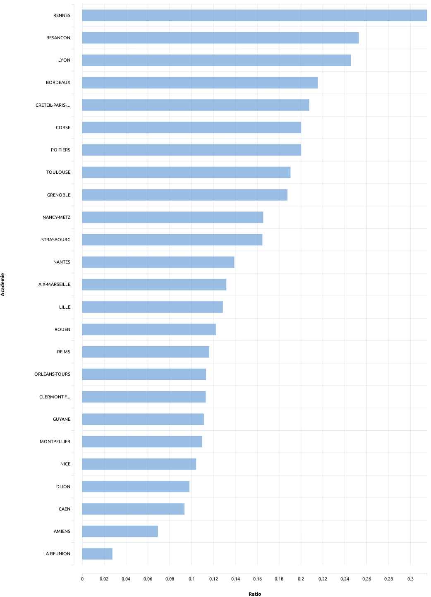
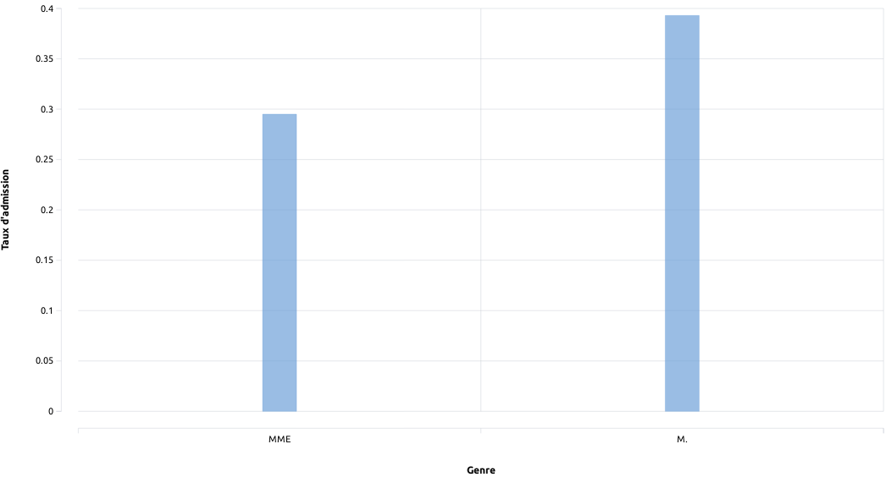
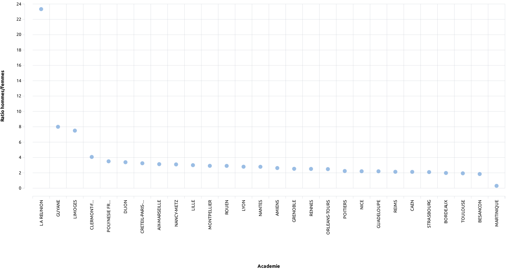
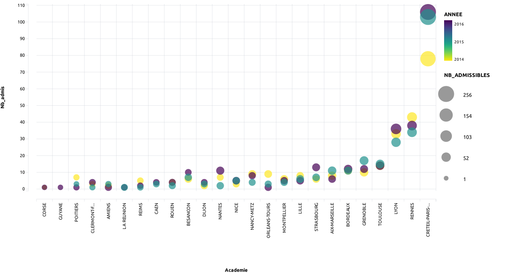
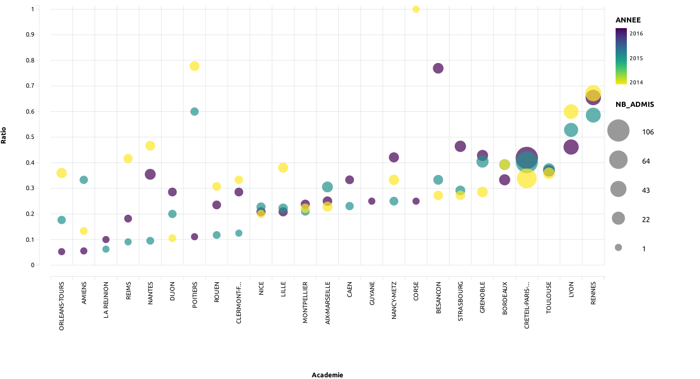
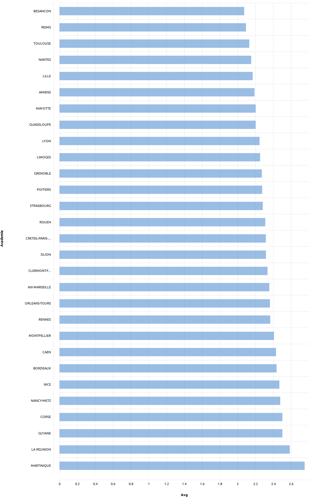
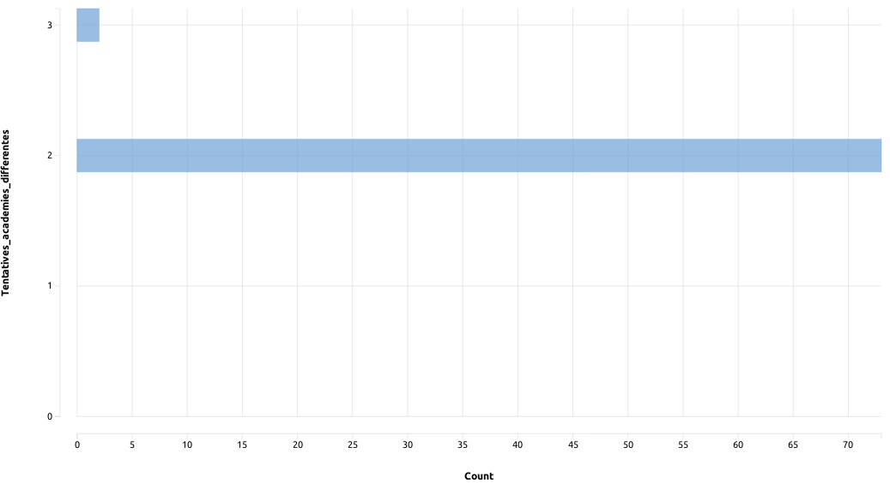

# Démonstrations de certains résultats obtenus

> Note : L'outil de visualisation est [SQLPad](https://rickbergfalk.github.io/sqlpad/).

## Admissibilité
Nombre de places à l'admissibilité :

Résultats d'admissibilité :

## Admission
Nombre de places à l'admission :

Résultats d'admission :

## Taux d'admission
Taux d'admission par académies :

Taux d'admission par genres :

Répartition hommes/femmes par académies :

## Évolution des résultats par académies
Évolution du nombre d'admissibles par académies :

Évolution du taux admission par académies :

## Redoublements
Nombres de redoublements (moyen) par académies :

## Questions
Combien de candidat-e-s ont passés l'agrégation dans au moins deux académies différentes ?

Combien de candidat-e-s ont passés l'agrégation (au moins) deux fois mais sans être admissible deux ans de suite ?

