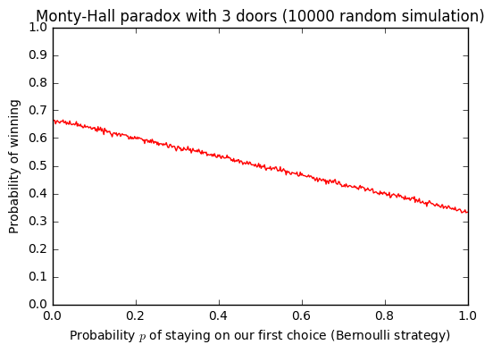

# :notebook: Notebooks pour des simulations numériques :fr:
> Ce dossier contient des [notebooks Jupyter](http://jupyter.org/), écrits en [Python (version 3)](https://docs.python.org/3/), pour mon plaisir.

[Liste des notebooks sur nbviewer.jupyter.org](https://nbviewer.jupyter.org/github/Naereen/notebooks/tree/master/simus/)

----

## Pour des jeux de dés
### Le jeu de 151
- [Simulations du jeu de 151](Simulations_du_jeu_de_151.ipynb), variante à 3 dés du jeu connu sous le nom de 5000 ou 10000.

### Paire de dés "tous jumeaux"
- [Calcul d'une paire de dés vérifiant certaines propriétés](Calcul_d_une_paire_de_des_un_peu_particuliers.ipynb).

----

## [Des dates qui sont aussi des nombres premiers](Des_dates_qui_font_des_nombres_premiers.ipynb)
- Vous saviez qu'en 2017, 71 jours sur 365 donnent des dates qui sont des nombres premiers ?
- Par exemple : 23/02/2017 -> `23022017` est premier, mais 24/02/2017 -> `24022017` ne l'est pas.
- Il y a 71 jours en 2017 qui ont une date première (et 69 si on utilise le format MoisJourAnnée).

----

## About numerical (apparent) paradoxes
### The [Monty-Hall problem](https://en.wikipedia.org/wiki/Monty_Hall_problem)
This [Naive simulations of the Monty-Hall problem](Naive_simulations_of_the_Monty-Hall_paradox.ipynb), proves that the best strategy is to always chose the other door, *i.e.*, to change from our initial choice to the door left by the master of the game.

- For 3 doors:

  

- For 100 doors:

  

----

### :information_desk_person: Plus d'informations ?
> - Les dépendances de ces notebooks se trouvent dans ce fichier [`requirements.txt`](requirements.txt).
> - Plus d'informations sur ce dépôt se trouvent [ici](..).
> - Plus d'informations sur [les notebooks (documentation de IPython)](https://nbviewer.jupiter.org/github/ipython/ipython/blob/3.x/examples/Notebook/Index.ipynb) ou [FAQ sur le site de Jupyter](https://nbviewer.jupyter.org/faq).
> - Plus d'informations sur [mybinder.org](http://mybinder.org/): dans [ce dépôt exemple](https://github.com/binder-project/example-requirements).

### :scroll: Licence
Tout ces documents sont distribues publiquement sous les conditions de la [licence MIT](http://lbesson.mit-license.org/) (fichier [LICENSE.txt](LICENSE.txt), en anglais).
© [Lilian Besson](https://github.com/Naereen), 2016.

